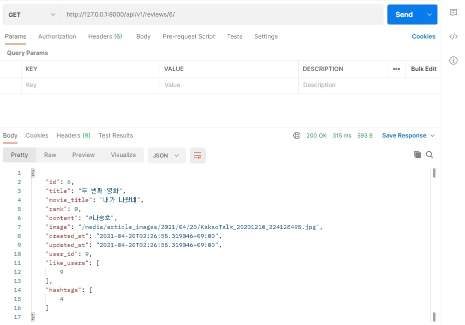

## 📘 Django_community_web 프로젝트

+ SSAFY(삼성 청년 SW 아카데미)과정에서 학습한 django, HTML, CSS, Ajax, Vue.js를 활용한 community 웹 페이지 제작 개인 프로젝트다.

+ 목표는 주 최소 3회 커밋!
  + 나의 감성이 들어간 웹 페이지를 제작해보자!

<br/>

<br/>

### 2021-04-11 추가

##### 웹 구동 방법 (git bash 사용)

+ 가상환경 설치

```
python -m venv venv  
```

+  가상환경 구동

```
source venv/Script/activate
```

+ 필요한 모듈 및 라이브러리 설치 (requirements.txt안에 리스트 존재)

```
pip install -r requirements
```

+ 마이그레이션 (DB에 테이블 생성)

```
python manage.py migrate
```

+ 서버 구동

```
python manage.py runserver
```

+ 메인 페이지 URL

```
http://127.0.0.1:8000/community 
```

<br/>

##### 소셜 로그인을 위한 세팅 (서버 입장에서)

+ admin 계정 생성


```
python manage.py createsuperuser
```

+ admin 페이지 입장

```
http://127.0.0.1:8000/admin
```

+ 소셜 계정 탭 소셜 어플리케이션에서 소셜 어플리케이션 추가 선택

  + 제공자(provider)를 선택
    + 소셜 로그인에 사용할 소셜
  + https://django-allauth.readthedocs.io/en/latest/providers.html 를 참고하여 각 제공자에서 OAUTH를 위한 API 등록 진행
  + 클라이언트 아이디, 비밀 키 선택 후 Sites에서 example.com을 추가하고 저장
  + 제공자에 따라 다르지만, Google의 경우 Google Cloud Platform의 'API 및 서비스' 탭의 '사용자 인증 정보'에서 소셜 로그인을 위해 생성한 클라이언트 ID에 들어간 후 승인된 리디렉션 URI에 http://127.0.0.1:8000/accounts/google/login/callback/ 을 입력해줘야 한다.
    + 소셜 로그인 후 리디렉션 될 URL
+ 소셜 로그인 세팅 완료, 로그인 시 구글 계정에 등록된 닉네임으로 username이 설정된다.

<br/>

<br/>

### 2021-04-12 추가

+ 유저와 게시물 정보의 **수정, 삭제** 기능 구현
+ 버튼 디자인 정리

<br/>

<br/>

### 2021-04-20 추가

+ 프로필 이미지, 게시물 이미지의 사이즈 조절 및 퀄리티 조절
  + `models.py`의 수정
  + 원형 이미지를 만들고 싶다면 `img`태그의 `class`에 `rounded-circle` 속성 주기
+ 메인 페이지 대 조정
  + 인스타그램, 페이스북, 틱톡처럼 요즘 감성의 카드 형식
    + bootstrap의 card component 활용 https://getbootstrap.com/docs/5.0/components/card/
  + 기타 위치 조절 및 불필요한 태그들 삭제 처리


<br/>

### 2021-05-06 추가

+ REST API를 위한 세팅 및 2가지 API 생성

+ 세팅


```
pip isntall djangorestframework
```

+ `community/serializers.py` 작성

+ 2가지 API 추가

  + 전체 리뷰 정보

    #### GET    /api/v1/reviews

  + 단일 리뷰 정보

    #### GET    /api/v1/reviews/{review_id}

+ 결과 예) 단일 영화 정보



<br/>

### 2021-05-09 추가

+ REST API 추가

  + 전체 해쉬태그 정보

    #### GET    /api/v1/hashtags

+ Like & Follow 기능 Ajax 방식으로 재구현
  + 기존의 좋아요, 팔로우 기능은 django만을 활용해 변경사항이 생길 때마다 페이지가 새로고침되었다.
  + 이를 Ajax를 활용해 재구성하여 페이지가 새로고침되지 않고도 기능이 구현되도록 하였다.
    + 이제 페이지가 새로고침되지 않기 때문에 좋아요나 팔로우를 누를 때마다 페이지 최상단으로 이동하지 않는다.
  + 사용자 경험상 편의가 향상되었다.
+ README 수정
  + 가독성을 높이고 필요없는 내용을 제거