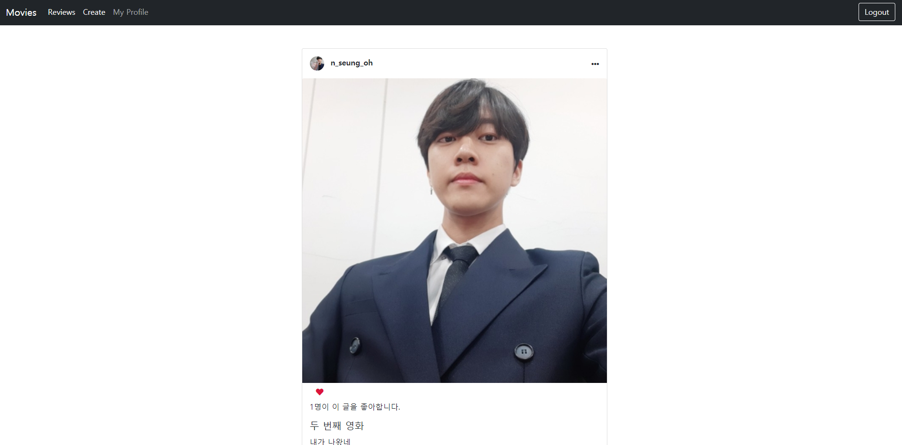

## 📘 Django_community_web 프로젝트

+ SSAFY(삼성 청년 SW 아카데미)과정에서 학습한 django, HTML, CSS를 활용한 community 웹 페이지 제작 개인 프로젝트다.

  +  `Django_project02_Like&Follow&Additional features`  프로젝트를 이어받아 진행한다.
+ 3월~4월 한 달여 배운 내용을 통해 진행하는 개인 프로젝트로, 완성도가 높지 않다 하더라도 이것저것 기능들을 구현해 볼 생각이다.
+ javascript를 아직 배우지 않아 다이나믹한 웹 페이지를 만들 수는 없지만, 가능한 웹 페이지에 다양한 기능들을 넣고 꾸며보겠다!

+ 목표는 주 최소 3회 커밋!
  + 나의 감성이 들어간 웹 페이지를 제작해보자!

 

 

### 2021-04-11 추가

##### 웹 구동 방법 (git bash 사용)

+ `python -m venv venv `- 가상환경 설치
+ `source venv/Script/activate`  - 가상환경 구동
+ `pip install -r requirements` - 필요한 모듈과 라이브러리 설치(requirements.txt안에 리스트 존재)
+ `python manage.py migrate` - 주어진 마이그레이션들에 따라 DB에 테이블 생성
+ `python manage.py runserver` - 서버 켜기
  + 터미널에 나오는 로컬 주소 `http://127.0.0.1:8000/`를 ctrl + 클릭
  + `http://127.0.0.1:8000/community` 메인 페이지 URL

 

##### 소셜 로그인을 위한 세팅 (서버 입장에서)

+ admin 계정 생성 후 admin 페이지로 입장

  + `python manage.py createsuperuser`로 어드민 계정 생성 가능
  + `http://127.0.0.1:8000/admin` 어드민 페이지 URL
+ 소셜 계정 탭 소셜 어플리케이션에서 소셜 어플리케이션 추가 선택

  + 제공자(provider)를 선택
    + 소셜 로그인에 사용할 소셜
  + https://django-allauth.readthedocs.io/en/latest/providers.html 를 참고하여 각 제공자에서 OAUTH를 위한 API 등록 진행
  + 클라이언트 아이디, 비밀 키 선택 후 Sites에서 example.com을 추가하고 저장
  + 제공자에 따라 다르지만, Google의 경우 Google Cloud Platform의 'API 및 서비스' 탭의 '사용자 인증 정보'에서 소셜 로그인을 위해 생성한 클라이언트 ID에 들어간 후 승인된 리디렉션 URI에 http://127.0.0.1:8000/accounts/google/login/callback/ 을 입력해줘야 한다.
    + 소셜 로그인 후 리디렉션 될 URL
+ 소셜 로그인 세팅 완료, 로그인 시 구글 계정에 등록된 닉네임으로 username이 설정된다.

 

 

### 2021-04-12 추가

+ 유저와 게시물 정보의 **수정, 삭제** 기능 구현
+ 버튼 디자인 정리

 

 

### 2021-04-20 추가

+ 프로필 이미지, 게시물 이미지의 사이즈 조절 및 퀄리티 조절
  + `models.py`의 수정
  + 원형 이미지를 만들고 싶다면 `img`태그의 `class`에 `rounded-circle` 속성 주기
+ 메인 페이지 대 조정
  + 인스타그램, 페이스북, 틱톡처럼 요즘 감성의 카드 형식
    + bootstrap의 card component 활용 https://getbootstrap.com/docs/5.0/components/card/
  + 기타 위치 조절 및 불필요한 태그들 삭제 처리

+ ps
  + 1주일에 3회 커밋을 목표로 하였지만 알고리즘 수업에 모든 시간을 쏟아부을 수 밖에 없었다...
  + 곧 다시 웹을 배우므로 더 열심히 커밋하도록 하자